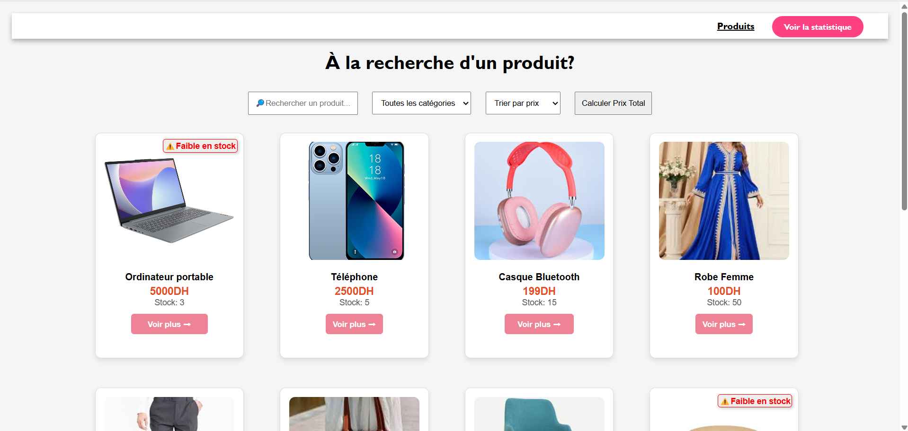
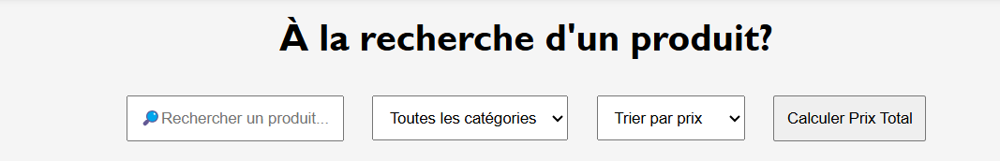
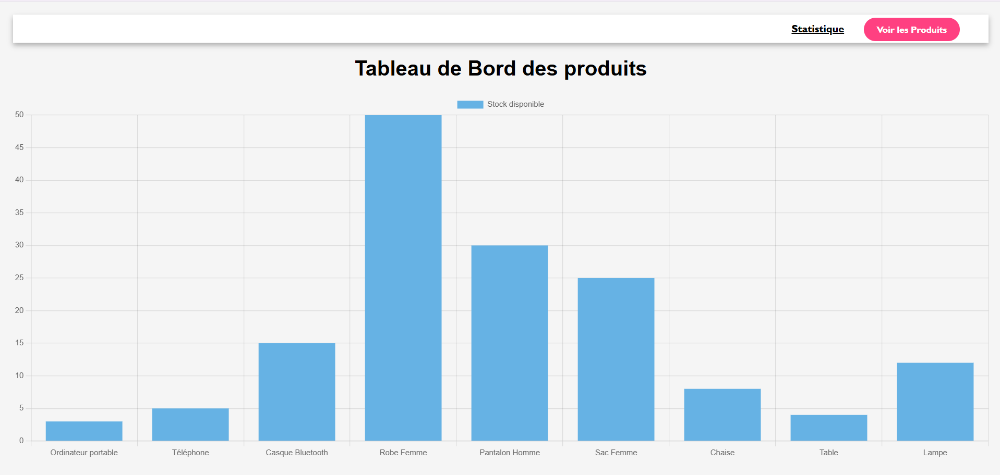

# Atelier 3 : JavaScript et Programmation Fonctionnelle

## Introduction

L'objectif de cet atelier est de se familiariser avec les concepts de la programmation fonctionnelle en JavaScript. Nous allons explorer plusieurs exercices utilisant des fonctions d'ordre supérieur telles que `filter()`, `map()`, `reduce()`, `sort()`, et d'autres méthodes natives de JavaScript pour manipuler des données efficacement.

---

## Exercices et Explications

### Exercice 1 : Filtrage des nombres pairs et tri croissant

Création d'une fonction qui filtre les nombres pairs d'une liste et les trie par ordre croissant.

- `filter(n => n % 2 === 0)`: Filtre les nombres pairs.
- `sort((a, b) => a - b)`: Trie les nombres par ordre croissant.

---

### Exercice 2 : Calcul des factorielles
Création d'une fonction qui applique la factorielle à chaque élément d'une liste.

- `map(factorial)`: Applique la fonction factorielle à chaque élément.
- `factorial(n)`: Fonction récursive pour calculer la factorielle d'un nombre.

---

### Exercice 3 : Manipulation de texte

Création d'une fonction qui divise un texte en lignes, met en majuscules et filtre celles contenant "I".

- `split('\n')`: Divise le texte en lignes.
- `map(line => line.toUpperCase())`: Convertit chaque ligne en majuscules.
- `filter(line => line.includes('I'))`: Garde uniquement les lignes contenant "I".

---

### Exercice 4 : Trouver le maximum d'une liste


Création  d'une fonction qui trouve le plus grand nombre dans une liste.
- `reduce((max, current) => (current > max ? current : max), numbers[0])`: Compare chaque élément et garde le plus grand.

---

### Exercice 5 : Calcul du prix total TTC

Calcul du prix total des produits avec une TVA de 25%.

- `reduce((sum, p) => sum + p.price * 1.25, 0)`: Calcule le total TTC.
- `toFixed(2)`: Garde deux décimales.

---

### Exercice 6 : Traitement des données des produits

## Description  
Cette application web permet de gérer un ensemble de produits en effectuant différentes opérations :  
- Filtrage des produits par catégorie  
- Calcul du prix total des produits en stock  
- Recherche des produits en faible stock  
- Tri des produits par prix ou par quantité en stock  
- Recherche de produits par nom  
- Visualisation des stocks avec des graphiques via Chart.js  

## Fonctionnalités  
✅ Affichage des produits sous forme de cartes  
✅ Barre de recherche pour filtrer les produits  
✅ Sélection de catégorie pour filtrer les résultats  
✅ Tri des produits par prix ou stock  
✅ Calcul automatique du prix total des produits  
✅ Indication des produits en faible stock  
✅ Dashboard interactif avec Chart.js  

## Technologies utilisées  
- **HTML** : Structure de la page  
- **CSS** : Mise en page et stylisation  
- **JavaScript (DOM & Fetch API)** : Gestion des interactions et traitement des données  
- **Chart.js** : Génération de graphiques dynamiques  
- **JSON** : Stockage des données produits  

## Installation et Exécution  
1. **Cloner le projet**  
   ```bash
   git clone https://github.com/Lorraine301/Atelier3_Javascript_Functional_Programming.git
  
   ```
2. **Ouvrir `index.html` dans un navigateur**  
   - Assurez-vous que `products.json` est bien accessible  
   - L'application fonctionne sans serveur, mais pour éviter les erreurs de lecture JSON, un serveur local peut être utilisé :  
     ```bash
     Télécharger l'extension Live Server
     ```

## Structure du Projet  
```
/exercice6
│── index.html          # Page principale pour afficher les produits
│── dashboard.html      # Tableau de bord des stocks
│── style.css          # Fichier CSS pour le design
│── exercice6.js       # Fichier JS principal pour gérer les interactions
│── dashboard.js       # Script JS pour générer le graphique Chart.js
│── products.json      # Base de données des produits
```

## Aperçu  
## Aperçu  
### 🎯 Interface Principale  
  

### 🔍 Filtrage et Recherche  
  

### 📊 Dashboard des Stocks  
    

## Auteur  
👨‍💻 Développé par **Lorraine301**  


## Conclusion

Cet Atelier  m'a permis d'explorer la puissance de la programmation fonctionnelle en JavaScript.On a vu comment utiliser les fonctions d'ordre supérieur pour manipuler des listes de données efficacement et comment appliquer ces concepts dans une application web interactive.

---

## Licence

Cet Atelier est sous licence MIT. Vous êtes libre de l'utiliser et de le modifier selon vos besoins.


